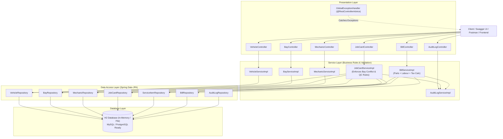
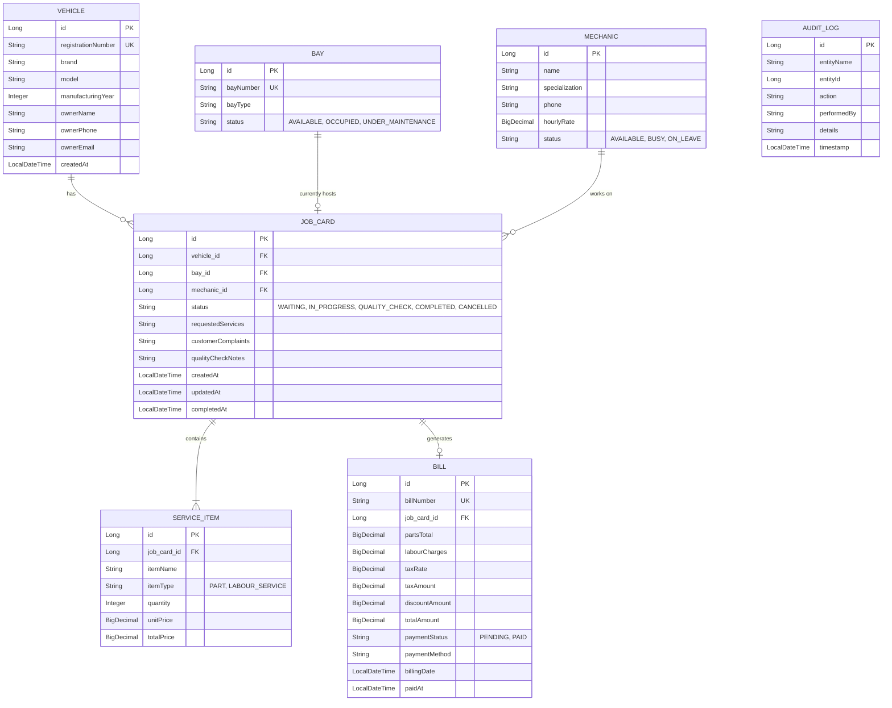

# 🚗 GarageDesk — Vehicle Service Job Card and Bay Scheduling System

**Sri Eshwar College of Engineering (Autonomous)**  
*Department of Computer Science and Engineering / IT*  
*Academic Year: 2026–2027 | Project Leap - Java & DBMS Assessment*  
**Question 67 | Student Register No: 060**

---

## 📌 Executive Summary & Problem Scenario

In conventional automotive service centers, vehicle assignments to mechanics and service bays are managed verbally each morning. This manual procedure causes:
1. **Bay Conflicts**: Double-booking service bays, resulting in bottlenecks and disorganized workshop floors.
2. **Unclear Job Progress**: Waiting customers and service advisors lack real-time visibility into whether a vehicle is waiting, undergoing maintenance, under inspection, or ready.
3. **Billing Discrepancies**: Disconnected tracking of spare parts consumed and labour hours spent, leading to inaccurate invoices.

**GarageDesk** is an enterprise-grade backend developed with **Spring Boot 3, Spring Data JPA, and RESTful Architecture** that automates the vehicle service workflow from vehicle check-in to automated final bill settlement.

---

## 🏗️ Architecture & System Design

The system adheres strictly to the **Layered Clean Architecture pattern**, separating presentation, business logic, persistence, and domain models.



---

## 🗄️ Database Design (Entity-Relationship Diagram)



---

## 🛡️ Business Rules Enforced

### 1. Bay Conflict Prevention (Rule 1)
- **Constraint**: *A service bay can hold only one active job card at a time.*
- **Enforcement**: In `JobCardServiceImpl.assignJobCard()`, before assigning a bay, the service queries `jobCardRepository.findActiveJobByBayId(bayId)`.
- If an active job (`WAITING`, `IN_PROGRESS`, or `QUALITY_CHECK`) already occupies that bay, the request is aborted immediately with a `409 CONFLICT` status code and a descriptive message:
  ```json
  {
    "timestamp": "2026-09-28T10:15:00",
    "status": 409,
    "error": "Bay Conflict - Already Occupied",
    "message": "Bay Conflict: Bay 'Bay 1' is already occupied by active Job Card #1 (IN_PROGRESS) for Vehicle 'TN-38-BZ-4521'. A bay can hold only one active job card at a time.",
    "path": "/api/job-cards/2/assign"
  }
  ```

### 2. Strict Quality-Check Workflow Enforcement (Rule 2)
- **Constraint**: *A job card cannot move to `COMPLETED` status until it has passed `QUALITY_CHECK`.*
- **Enforcement**: In `JobCardServiceImpl.updateJobStatus()`, when target status is `COMPLETED`, the current status is strictly validated. Direct jumps from `WAITING` or `IN_PROGRESS` to `COMPLETED` are rejected with `400 BAD_REQUEST`:
  ```json
  {
    "timestamp": "2026-09-28T10:15:00",
    "status": 400,
    "error": "Invalid Status Transition",
    "message": "Business Rule Violation: Job Card #2 cannot move directly from 'IN_PROGRESS' to 'COMPLETED'. It must first pass 'QUALITY_CHECK'.",
    "path": "/api/job-cards/2/status"
  }
  ```
- **Lifecycle Transition Path**:
  $$\text{WAITING} \longrightarrow \text{IN\_PROGRESS} \longrightarrow \text{QUALITY\_CHECK} \longrightarrow \text{COMPLETED}$$

### 3. Automated Bay & Mechanic Freeing
- Once a job reaches `COMPLETED` or `CANCELLED`, the associated Bay is automatically reset to `AVAILABLE`, and the Mechanic's status is reset to `AVAILABLE`.

### 4. Automated Bill Calculation
- Final bill is computed dynamically:
  $$\text{Subtotal} = \sum (\text{Parts Used}) + \sum (\text{Labour Charges}) - \text{Discount}$$
  $$\text{Tax Amount} = \text{Subtotal} \times \frac{\text{Tax Rate}}{100}$$
  $$\text{Total Amount} = \text{Subtotal} + \text{Tax Amount}$$

---

## 🚀 How to Run the Application

### Prerequisites
- **Java 17+** (`java -version`)
- **Maven 3.8+** (`mvn -version`)

### Quick Start
1. Open terminal inside the project directory:
   ```bash
   mvn clean spring-boot:run
   ```
2. The application will start at: `http://localhost:8080`

### Interactive Documentation & Testing
- **Swagger 3.0 / OpenAPI UI**:  
  👉 **`http://localhost:8080/swagger-ui.html`**
- **H2 Database Console**:  
  👉 **`http://localhost:8080/h2-console`**  
  *(JDBC URL: `jdbc:h2:mem:garagedeskdb` | User: `sa` | Password: `password`)*

---

## 🧪 Pre-Seeded Demo Data (`DataInitializer`)

For immediate evaluation, the database starts with realistic seed data:
- **4 Service Bays**:
  - `Bay 1`: *Express Lube & Quick Service* (Status: `OCCUPIED` by JobCard #1)
  - `Bay 2`: *General Mechanical & Suspension* (Status: `AVAILABLE`)
  - `Bay 3`: *Wheel Alignment & Balancing* (Status: `AVAILABLE`)
  - `Bay 4`: *Computer Diagnostics & Electrical* (Status: `AVAILABLE`)
- **3 Technicians / Mechanics**:
  - `Rajesh Kumar` (Senior Engine Specialist)
  - `Suresh Babu` (Brake & Suspension)
  - `Anand Prakash` (Diagnostics & Electrical)
- **3 Customer Vehicles**:
  - `TN-38-BZ-4521` (Toyota Innova Crysta - Arun Kumar)
  - `TN-37-CK-9912` (Honda City ZX - Priya Sharma)
  - `TN-66-E-1004` (Hyundai Creta SX - Karthik Raja)
- **Sample Active Job Card #1**: Occupies Bay 1, assigned to Rajesh Kumar, with parts & labour already logged.
- **Sample Waiting Job Card #2**: Ready to test scheduling into Bay 2, 3, or 4!

---

## 📡 REST API Reference

| Method | Endpoint | Description | Business Rules / Constraints |
| :--- | :--- | :--- | :--- |
| **POST** | `/api/vehicles` | Register vehicle & owner details | Duplicate registration numbers rejected |
| **GET** | `/api/vehicles` | List all registered vehicles | — |
| **GET** | `/api/bays` | List all service bays & current active jobs | — |
| **GET** | `/api/bays/available` | List only free bays ready for work | — |
| **GET** | `/api/mechanics` | List all garage mechanics | — |
| **POST** | `/api/job-cards` | Create new job card | Initial status defaults to `WAITING` |
| **PUT** | `/api/job-cards/{id}/assign` | Assign Bay & Mechanic | **Rule 1: Rejects if Bay is already occupied** |
| **PATCH** | `/api/job-cards/{id}/status` | Advance job status | **Rule 2: Cannot complete before QUALITY_CHECK** |
| **POST** | `/api/job-cards/{id}/items` | Add parts or labour charges | Recalculates bill totals if generated |
| **POST** | `/api/bills/job-card/{jobCardId}` | Generate final bill | Computes parts + labour + 18% GST |
| **POST** | `/api/bills/{id}/pay` | Record payment | Sets payment status to `PAID` |
| **GET** | `/api/audit-logs` | Retrieve accountability audit trail | Records all status changes and operations |

---

## 🏆 Assessment Rubric Coverage (100/100)

| Rubric Criteria | Weightage | GarageDesk Implementation Highlights |
| :--- | :---: | :--- |
| **1. Technical Implementation** | **40 Marks** | Complete Spring Boot 3 & JPA implementation, full CRUD, DTO mappings, Bay conflict validation, quality-check verification, billing calculation. |
| **2. System Design & Architecture**| **25 Marks** | Layered Architecture (Controller $\to$ Service $\to$ Repository $\to$ Entity), ER diagrams, UML workflow, separation of concerns. |
| **3. Code Quality & Efficiency** | **20 Marks** | Centralized `@RestControllerAdvice`, Custom domain exceptions (`BayConflictException`, `InvalidStatusTransitionException`), Bean validation (`@Valid`, `@NotNull`), clean code. |
| **4. Presentation & Demo (Q&A)** | **15 Marks** | Swagger UI (`/swagger-ui.html`), Pre-seeded `DataInitializer`, complete documentation and automated test suite. |
